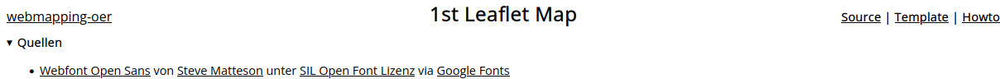
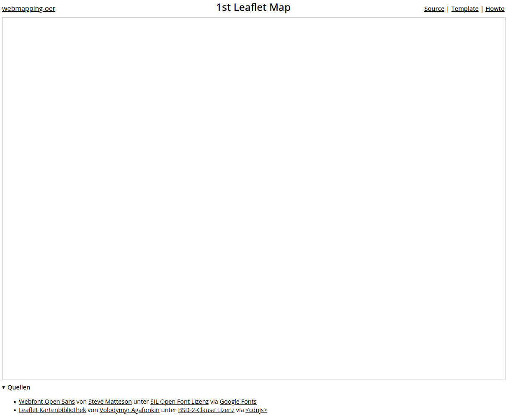
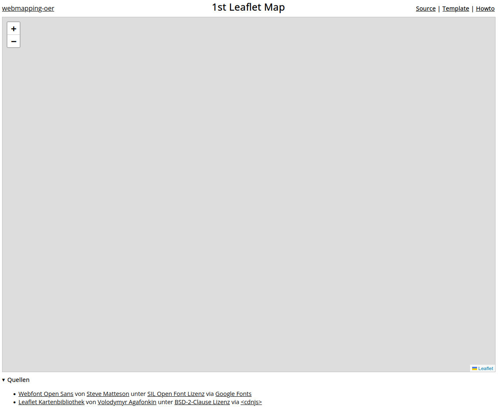
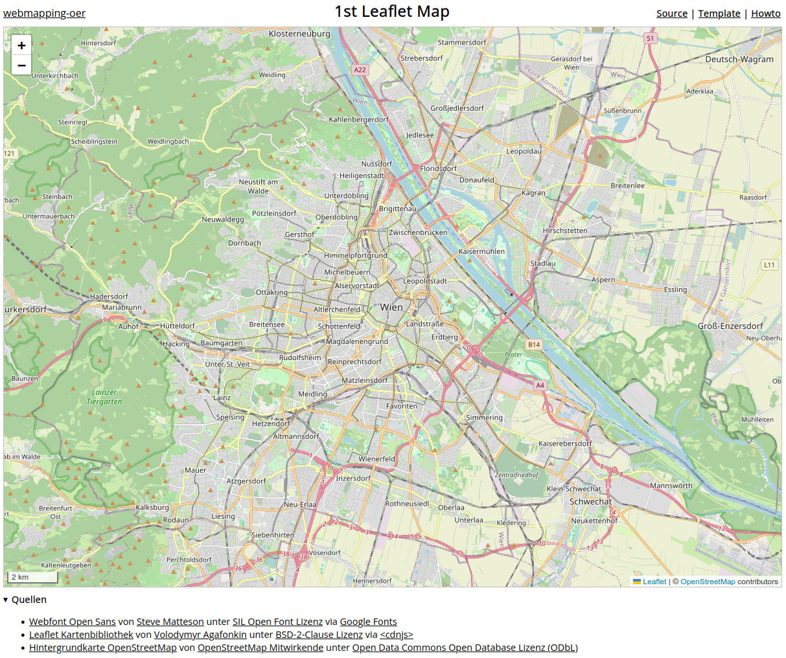

# Howto: 1st Leaflet Map

Web: <https://webmapping-oer.github.io/1st-leaflet-map/>

Source: <https://github.com/webmapping-oer/1st-leaflet-map>

Template: <https://webmapping-oer.github.io/1st-leaflet-map/template.zip>

## 1. Template auspacken

Unter <https://webmapping-oer.github.io/1st-leaflet-map/template.zip> liegt ein vorbereitetes HTML/CSS/Javascript Template mit den Dateien `index.html`, `main.css` und `main.js` - sie sind die Basis für unser erstes Leaflet Beispiel. Wir packen `template.zip` am `Desktop` in einem Unterverzeichnis `1stmap` aus und Öffnen dieses Verzeichnis mit **Visual Studio Code** über `File / Open Folder`.

Mit Hilfe des VScode **Live Server Plugins** von Ritwick Dey können wir die Webseite des Templates auf einem lokalen Webserver wie im Web betrachten. Ein Klick aug `Go Live` im rechten unteren Eck von VScode startet diesen Server und zeigt die noch recht unspektakuläre Seite im Standardbrowser an. Änderungen an unserer Seite werden später beim Speichern dort direkt angezeigt.

siehe Commit <https://github.com/webmapping-oer/1st-leaflet-map/commit/8d1aa783bb3c180ba9703591f1cd46029a327a45>

> Screenshot des Karten-Templates von [webmapping-oer](https://github.com/webmapping-oer/) unter der Lizenz [CC0 1.0](https://creativecommons.org/publicdomain/zero/1.0/deed.de)




## 2. Grundkarte erstellen

Für unsere erste Grundkarte benötigen wir vier kleine Schritte

### Schritt 1: Leaflet Bibliothek einbinden

Im ersten Schritt binden wir die **Leaflet Bibliothek** im &lt;head&gt;-Bereich von `index.html` über <https://cdnjs.com/> ein. Die Suche dort nach *Leaflet* bringt uns direkt zu <https://cdnjs.com/libraries/leaflet>. Mit dem *Copy Script Tag* Icon (&lt;/&gt;) kopieren wir sowohl den Verweis auf `leaflet.js` (die zentrale Javascript Bibliothek) als auch den Verweis zu `leaflet.css`, dem Leaflet CSS Stylesheet und fügen beide in der `index.html` Datei ein. Die Quelle der Leaflet Bibliothek von Volodymyr Agafonkin ergänzen wir zusätzlich im &lt;footer&gt; Bereich der Seite.

siehe Commit <https://github.com/webmapping-oer/1st-leaflet-map/commit/cfb7cbd592dc7ba779390fe5a4db004b73e9acca>

### Schritt 2: Kartenbereich festlegen

Den Kartenbereich legen wir als &lt;div&gt;-Element im &lt;article&gt;-Bereich von `index.html` fest. Über das **id-Attribut** `map` können wir diesen Kartenbereich später im Javascript ansprechen und mit der Leaflet-Bibliothek dort die Karte zeichnen.

```html
<article>
<!-- Seiteninhalt -->
    <div id="map"></div>
</article>
```

siehe COMMIT <https://github.com/webmapping-oer/1st-leaflet-map/commit/8f7bbdee3b085e6b4c0ef448c675353f46bfdbcf>

Die Größe und Randlinien der Karte definieren wir über CSS in `main.css`

```css
#map {
    width: 100%;
    height: 80vh;
    border: 1px solid silver;
}
```

siehe COMMIT <https://github.com/webmapping-oer/1st-leaflet-map/commit/105b6a5a8c2635f42311909ccb1de7246e260e43>

> Screenshot des Templates mit Kartenbereich von [webmapping-oer](https://github.com/webmapping-oer/) unter der Lizenz [CC0 1.0](https://creativecommons.org/publicdomain/zero/1.0/deed.de)



### Schritt 3: Karte initialisieren und Ausschnitt setzen

Damit ist das Layout vorbereitet und wir können die Karte in `main.js` mit `L.map`, unserem ersten Aufruf an die Leaflet-Bibliothek, initialisieren

```javascript
// Karte initialisieren
let map = L.map("map");
```

siehe Commit <https://github.com/webmapping-oer/1st-leaflet-map/commit/c3c96c3b35be8134f7ce107ad5c52ef395319f94>

- `let map` speichert eine Referenz zur Karte in der Variablen `map`
- `L.map()` weist die Leaflet Bibliothek an, eine Karte zu initialisieren
- `"map"` als Argument beim Aufruf legt fest, dass die Karte in einem Bereich mit dem id-Attribut `map`, also unserem &lt;div&gt;-Element, gezeichnet werden soll.

> Screenshot der initialisierten Karte ohne Hintergrund Layer von [webmapping-oer](https://github.com/webmapping-oer/) unter der Lizenz [CC0 1.0](https://creativecommons.org/publicdomain/zero/1.0/deed.de)



Der (jetzt) graue Kartenhintergrund signalisiert uns, dass das Initialisieren der Karte erfolgreich war und wir können den Ausschnitt auf Wien setzen. Als Mittelpunkt wählen wir den Stephansdom. Seine Koordinaten besorgen wir uns vom Wikipedia-Eintrag <https://de.wikipedia.org/wiki/Wien> und setzen den Zoom-Level des Ausschnitts auf `12`. Damit sollte später das gesamte Stadtgebiet von Wien sichtbar sein.

```javascript
// auf den Stephansdom blicken
map.setView([48.208493, 16.373118], 12);
```
siehe Commit <https://github.com/webmapping-oer/1st-leaflet-map/commit/b1b66757afd1e76520b904e5fcd483619c081d51>

Wohin wir genau blicken, wird erst im nächsten Schritt klar, denn wir ersetzen den grauen Hintergrund mit einer OpenStreetMap Karte

### Schritt 4: Hintergrundkarte der OpenStreetMap anzeigen

Kartenhintergründe werden bei Online Karten meist mit sogenannten *Web Map Tile Services (WMTS)* erzeugt. Ein vielfach genutzter und frei unter der [Open Data Commons Open Database Lizenz (ODbL)](https://opendatacommons.org/licenses/odbl/) verfügbarer WMTS-Dienst ist die OpenStreetMap. Wir binden sie als Leaflet TileLayer ein:

```javascript
// Hintergrundkarte der OpenStreetMap hinzufügen
L.tileLayer("https://tile.openstreetmap.org/{z}/{x}/{y}.png", {
    attribution: `© <a href="https://www.openstreetmap.org/copyright">OpenStreetMap</a> contributors`
}).addTo(map);
```

siehe Commit <https://github.com/webmapping-oer/1st-leaflet-map/commit/53130099dc8d37556339fded21b3f5e1eb5faa0f>

Damit ist unsere Karte fast fertig, es fehlt nur noch der Maßstab, den wir als Leaflet Scale Control in der linken unteren Ecke platzieren

```javascript
// Maßstab
L.control.scale({
    imperial: false
}).addTo(map);
```

siehe Commit <https://github.com/webmapping-oer/1st-leaflet-map/commit/94fe052f0ea057394bb08df715266ea18fed0016>

Damit ist unsere erste Leaflet Karte fertig!

> Screenshot der der ersten Leaflet Karte mit Hintergrund Layer der OpenStreetMap von [webmapping-oer](https://github.com/webmapping-oer/) unter der Lizenz [CC0 1.0](https://creativecommons.org/publicdomain/zero/1.0/deed.de)


