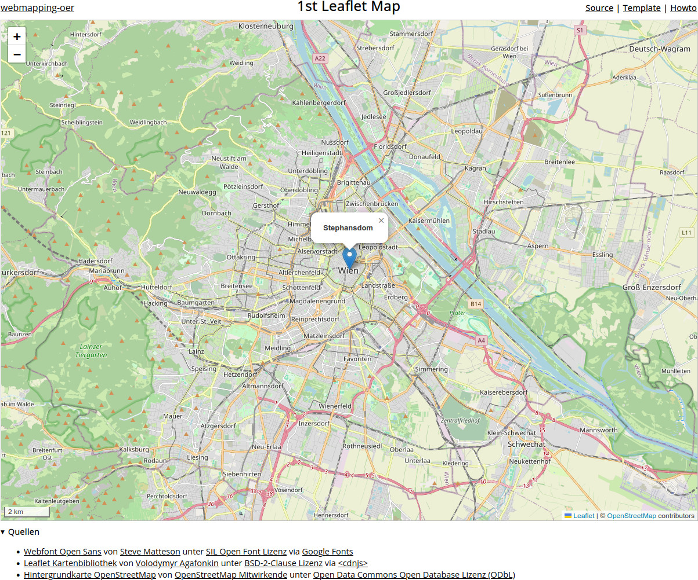
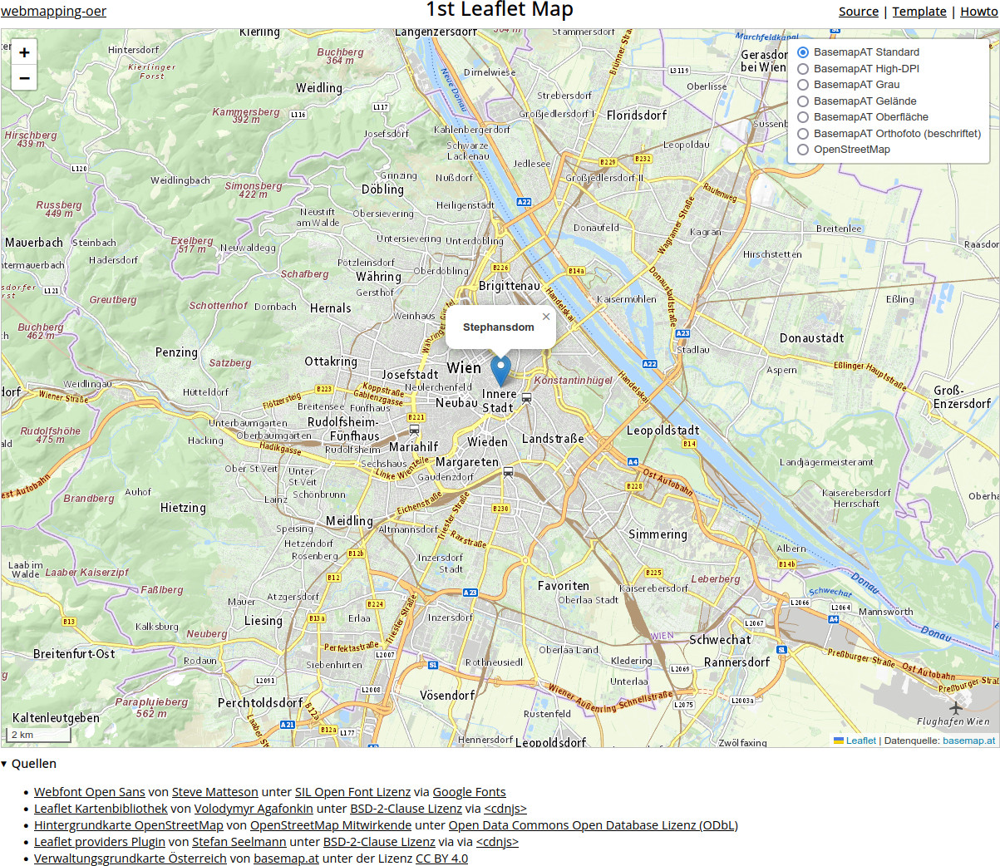

# Howto: 1st Leaflet Map

Web: <https://webmapping-oer.github.io/1st-leaflet-map/>

Source: <https://github.com/webmapping-oer/1st-leaflet-map>

Template: <https://webmapping-oer.github.io/1st-leaflet-map/template.zip>

## 1. Template auspacken

Unter <https://webmapping-oer.github.io/1st-leaflet-map/template.zip> liegt ein vorbereitetes HTML/CSS/Javascript Template mit den Dateien `index.html`, `main.css` und `main.js` ([siehe Commit](https://github.com/webmapping-oer/1st-leaflet-map/commit/8d1aa783bb3c180ba9703591f1cd46029a327a45)). Sie sind die Basis für unser erstes Leaflet Beispiel. Wir packen `template.zip` am `Desktop` in einem Unterverzeichnis `1stmap` aus und Öffnen dieses Verzeichnis mit **Visual Studio Code** (VScode ab jetzt) über `File / Open Folder`.

Mit Hilfe des VScode [Live Server Plugins](https://github.com/ritwickdey/vscode-live-server/) von Ritwick Dey können wir die Webseite des Templates auf einem lokalen Webserver wie online im Web betrachten. Ein Klick aug `Go Live` im rechten unteren Eck von VScode startet diesen Server und zeigt die noch recht unspektakuläre Seite im Standardbrowser an. Änderungen an unserer Seite werden später beim Speichern dort direkt angezeigt.

---

> Screenshot des Karten-Templates von [webmapping-oer](https://github.com/webmapping-oer/) unter der Lizenz [CC0 1.0](https://creativecommons.org/publicdomain/zero/1.0/deed.de)

---

## 2. Grundkarte erstellen

### Schritt 1: Leaflet Bibliothek einbinden

Im ersten Schritt binden wir die **Leaflet Bibliothek** im &lt;head&gt;-Bereich von `index.html` über <https://cdnjs.com/> ein. Die Suche dort nach *Leaflet* bringt uns direkt zu <https://cdnjs.com/libraries/leaflet>. Mit dem *Copy Script Tag* Icon (&lt;/&gt;) kopieren wir sowohl den Verweis auf `leaflet.js` (die zentrale Javascript Bibliothek) als auch den Verweis zu `leaflet.css`, dem Leaflet CSS Stylesheet und fügen beide in der `index.html` Datei ein. Die Quelle der Leaflet Bibliothek von Volodymyr Agafonkin ergänzen wir zusätzlich im &lt;footer&gt; Bereich der Seite ([siehe Commit](https://github.com/webmapping-oer/1st-leaflet-map/commit/cfb7cbd592dc7ba779390fe5a4db004b73e9acca)).

```html
<!-- Leaflet -->
<script src="https://cdnjs.cloudflare.com/ajax/libs/leaflet/1.9.4/leaflet.js"></script>
<link rel="stylesheet" href="https://cdnjs.cloudflare.com/ajax/libs/leaflet/1.9.4/leaflet.css" />
```

### Schritt 2: Kartenbereich festlegen

Den Kartenbereich legen wir als &lt;div&gt;-Element im &lt;article&gt;-Bereich von `index.html` fest. Über das **id-Attribut** `map` können wir diesen Kartenbereich später im Javascript ansprechen und mit der Leaflet-Bibliothek dort die Karte zeichnen ([siehe COMMIT](https://github.com/webmapping-oer/1st-leaflet-map/commit/8f7bbdee3b085e6b4c0ef448c675353f46bfdbcf)).

```html
<article>
<!-- Seiteninhalt -->
    <div id="map"></div>
</article>
```

Die Größe und Randlinien der Karte definieren wir über CSS in `main.css` ([siehe COMMIT](https://github.com/webmapping-oer/1st-leaflet-map/commit/105b6a5a8c2635f42311909ccb1de7246e260e43)):

```css
#map {
    width: 100%;
    height: 80vh;
    border: 1px solid silver;
}
```

---

> Screenshot des Templates mit Kartenbereich von [webmapping-oer](https://github.com/webmapping-oer/) unter der Lizenz [CC0 1.0](https://creativecommons.org/publicdomain/zero/1.0/deed.de)

---

### Schritt 3: Karte initialisieren und Ausschnitt setzen

Damit ist das Layout vorbereitet und wir können die Karte in `main.js` mit `L.map()`, unserem ersten Aufruf an die Leaflet-Bibliothek, initialisieren ([siehe Commit](https://github.com/webmapping-oer/1st-leaflet-map/commit/c3c96c3b35be8134f7ce107ad5c52ef395319f94)):

```javascript
// Karte initialisieren
let map = L.map("map");
```

- `let map` speichert eine Referenz zur Karte in der Variablen `map`
- `L.map()` weist die Leaflet Bibliothek an, eine Karte zu initialisieren
- `"map"` als Argument beim Aufruf legt fest, dass die Karte in einem Bereich mit dem id-Attribut `map`, also unserem &lt;div&gt;-Element, gezeichnet werden soll.

---

> Screenshot der initialisierten Karte ohne Hintergrund Layer von [webmapping-oer](https://github.com/webmapping-oer/) unter der Lizenz [CC0 1.0](https://creativecommons.org/publicdomain/zero/1.0/deed.de)

---

Die Zoom-Control Links Oben und der graue Kartenhintergrund signalisieren uns, dass die Initialisierung der Karte erfolgreich war und wir können den Ausschnitt mit `map.setView()` auf Wien setzen. Als Mittelpunkt wählen wir den Stephansdom, dessen Koordinaten wir dem Wikipedia-Eintrag <https://de.wikipedia.org/wiki/Wien> entnehmen. Den Zoom-Level des Ausschnitts legen wir mit `12` fest - damit sollte später das gesamte Stadtgebiet von Wien sichtbar sein ([siehe Commit](https://github.com/webmapping-oer/1st-leaflet-map/commit/b1b66757afd1e76520b904e5fcd483619c081d51)).

```javascript
// auf den Stephansdom blicken
map.setView([48.208493, 16.373118], 12);
```

Wohin wir genau blicken, wird erst im nächsten Schritt klar, denn wir ersetzen den grauen Hintergrund mit einem `L.tileLayer()` der OpenStreetMap Karte

### Schritt 4: Hintergrundkarte der OpenStreetMap anzeigen

Kartenhintergründe werden bei Online Karten meist mit sogenannten *Web Map Tile Services (WMTS)* erzeugt. Ein vielfach genutzter und frei unter der [Open Data Commons Open Database Lizenz (ODbL)](https://opendatacommons.org/licenses/odbl/) verfügbarer WMTS-Dienst ist die OpenStreetMap. Wir binden sie als Leaflet TileLayer `L.tileLayer()`  ein ([siehe Commit](https://github.com/webmapping-oer/1st-leaflet-map/commit/53130099dc8d37556339fded21b3f5e1eb5faa0f)):

```javascript
// Hintergrundkarte der OpenStreetMap hinzufügen
L.tileLayer("https://tile.openstreetmap.org/{z}/{x}/{y}.png", {
    attribution: `© <a href="https://www.openstreetmap.org/copyright">OpenStreetMap</a> contributors`
}).addTo(map);
```

Damit ist unsere Karte fast fertig, es fehlt nur noch der Maßstab, den wir als Leaflet Scale Control `L.control.scale()`in der linken unteren Ecke platzieren. `imperial: false` bewirkt, dass nur die metrische Skala angezeigt wird ([siehe Commit](https://github.com/webmapping-oer/1st-leaflet-map/commit/94fe052f0ea057394bb08df715266ea18fed0016)):

```javascript
// Maßstab
L.control.scale({
    imperial: false
}).addTo(map);
```

Damit ist unsere erste Leaflet Karte fast fertig, denn wir wollen auch den Kartenmittelpunkt mit einem Marker und Popup hervorheben

---

> Screenshot der ersten Leaflet Karte mit Hintergrund Layer der OpenStreetMap von [webmapping-oer](https://github.com/webmapping-oer/) unter der Lizenz [CC0 1.0](https://creativecommons.org/publicdomain/zero/1.0/deed.de)

---

## 3. Marker mit Popup hinzufügen

Über die Leaflet-Bibliothek können wir mittels `map.setView()` nicht nur auf die Koordinaten des Stephansdoms blicken, sondern dort mit `L.marker()` auch einen Standardmarker platzieren. Wir speichern ihn in einer Variablen `marker`, setzen seine Koordinaten als Array auf die geographische Länge und Breite und hängen ihn mit `.addTo(map)` an die Karte ([siehe Commit](<https://github.com/webmapping-oer/1st-leaflet-map/commit/903eb6cc31e702de488bb27255661e6854835b4b)):

```javascript
// Marker für den Stephansdom hinzufügen
let marker = L.marker([48.208493, 16.373118]).addTo(map);
```

Das Popup für den Marker ergänzen wir mit `marker.bindPopup()`, wobei wir den Inhalt des Popups als [Javascript Template literal](https://developer.mozilla.org/en-US/docs/Web/JavaScript/Reference/Template_literals) definieren. Nachdem der Inhalt jedes Popups auch HTML-Code sein kann, wählen wir eine Überschrift 4. Mit `.openPopup()` können wir das Popup auch direkt anzeigen ([siehe Commit](https://github.com/webmapping-oer/1st-leaflet-map/commit/eed8285ab0fdfeeb79fe56301b71d6e9cd177c72)):

```javascript
// Popup zum Marker hinzufügen und öffnen
marker.bindPopup(`
    <h4>Stephansdom</h4>
`).openPopup();
```

---

> Screenshot der ersten Leaflet Karte mit Marker und Popup von [webmapping-oer](https://github.com/webmapping-oer/) unter der Lizenz [CC0 1.0](https://creativecommons.org/publicdomain/zero/1.0/deed.de)

---

## 4. Verwaltungsgrundkarte Österreichs über Leaflet.providers verwenden

Damit ist unsere Karte fast fertig, denn wir wollen noch die Verwaltungsgrundkarte Österreichs [basemap.at](https://basemap.at) unter der Lizenz [CC BY 4.0](https://creativecommons.org/licenses/by/4.0/deed.de) an Stelle der OpenStreetMap als Kartenhintergrund verwenden. Um uns die Arbeit zu erleichtern, verwenden wir das Leaflet-Plugin [Leaflet.providers](https://github.com/leaflet-extras/leaflet-providers) und binden es wie die Leaflet-Bibliothek wieder über <https://cdnjs.com/> ein. Die Suche dort nach *Leaflet providers* bringt uns direkt zu <https://cdnjs.com/libraries/leaflet-providers>. Mit dem *Copy Script Tag* Icon (&lt;/&gt;) kopieren wir den Verweis auf `leaflet-providers.js` in den &lt;head&gt;-Bereich von `index.html`. Die Quelle des Leaflet.providers Plugins von Stefan Seelmann ergänzen wir zusätzlich im &lt;footer&gt; Bereich der Seite ([siehe Commit](https://github.com/webmapping-oer/1st-leaflet-map/commit/1b03c5089fd09503e3769995ecdd6e8752d85f11)):

```html
<!-- Leaflet providers -->
<script src="https://cdnjs.cloudflare.com/ajax/libs/leaflet-providers/1.13.0/leaflet-providers.js"></script>

```

Statt dem `L.tileLayer()` Aufruf der OpenStreetMap erzeugen wir mit `L.control()` eine Leaflet Layer-Control und definieren den OpenStreetMap Eintrag über `L.tileLayer.provider()`. Wir müssen nur das entsprechende Kürzel für die OpenStreetMap als Argument übergeben ([siehe Commit](https://github.com/webmapping-oer/1st-leaflet-map/commit/14851524a59afa9bc5e64a236944040d4a7cbe64)). Die Demoseite des Leaflet.providers Plugins unter <https://leaflet-extras.github.io/leaflet-providers/preview/> listet bequem alle verfügbaren Hintergrundlayer mit ihren Kürzeln auf.

```javascript
L.control.layers({
    "OpenStreetMap": L.tileLayer.provider("OpenStreetMap.Mapnik").addTo(map)
})
```

Damit die Layer Control in der Karte sichtbar wird, müssen wir sie mit `.addTo(map)` wieder an die Karte hängen ([siehe Commit](<https://github.com/webmapping-oer/1st-leaflet-map/commit/a7ec38d9a8dfed07aae5966d215f5b9251180538)):

```javascript
L.control.layers({
    "OpenStreetMap": L.tileLayer.provider("OpenStreetMap.Mapnik").addTo(map)
}).addTo(map);
```

Die beiden `.addTo(map)` Aufrufe mögen anfangs verwirrend sein, sind aber zwei getrennte Dinge. Das erste `.addTo(map)` beim OpenStreetMap-Layer bewirkt, dass dieser beim Laden der Karte direkt angezeigt wird. Das zweite `.addTo(map)` kümmert sich darum, dass die Layer-Control in der rechten oberen Ecke der Karte als Hamburger-Menü angezeigt wird. Dort können wir jetzt fünf Layer der Verwaltungsgrundkarte Österreichs ergänzen. Die nötigen Kürzel finden wir wieder auf der Demoseite des Leaflet.providers Plugins. Mit `addTo(map)` laden wir den BasemapAT Standard-Layer an Stelle der OpenStreetMap ([siehe Commit](https://github.com/webmapping-oer/1st-leaflet-map/commit/2f091455154b3e0e71e5a0f418ed763d5821742e)):

```javascript
L.control.layers({
    "BasemapAT Standard": L.tileLayer.provider("BasemapAT.basemap").addTo(map),
    "BasemapAT High-DPI": L.tileLayer.provider("BasemapAT.highdpi"),
    "BasemapAT Grau": L.tileLayer.provider("BasemapAT.grau"),
    "BasemapAT Gelände": L.tileLayer.provider("BasemapAT.terrain"),
    "BasemapAT Oberfläche": L.tileLayer.provider("BasemapAT.surface"),
    "OpenStreetMap": L.tileLayer.provider("OpenStreetMap.Mapnik"),
}).addTo(map);
```

Für das Orthofoto der Verwaltungsgrundkarte verwenden wir eine Kombination aus Bild und Beschriftung, die wir als `L.layerGroup()` über einen Array der jeweiligen `L.tileLayer.provider()` Layer definieren ([siehe Commit](https://github.com/webmapping-oer/1st-leaflet-map/commit/77447978b5138d9c062c285ab1540ce68cc23ea9)):

```javascript
"BasemapAT Orthofoto (beschriftet)": L.layerGroup([
    L.tileLayer.provider("BasemapAT.orthofoto"),
    L.tileLayer.provider("BasemapAT.overlay"),
]),
```

---

> Screenshot der ersten Leaflet Karte mit Marker, Popup und Verwaltungsgrundkarte Österreich von [webmapping-oer](https://github.com/webmapping-oer/) unter der Lizenz [CC0 1.0](https://creativecommons.org/publicdomain/zero/1.0/deed.de)

---

